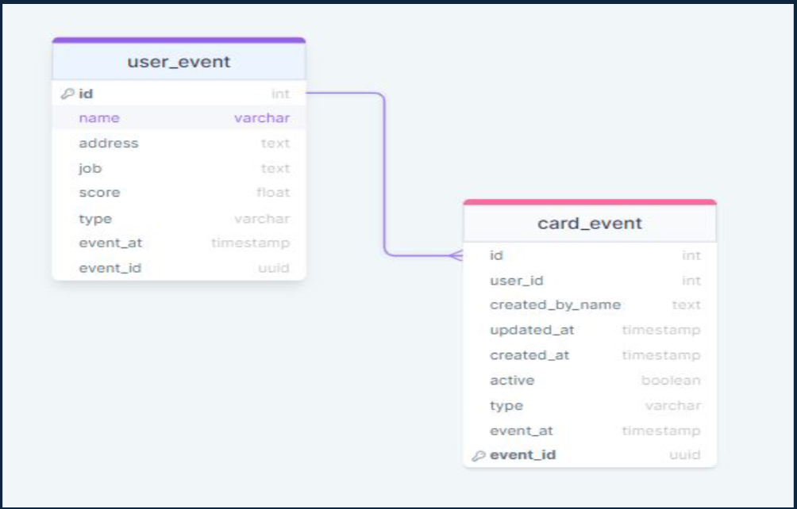

# Financial_industry_transaction_Project
## Introduction

This project is aimed at testing my knowledge of creating a relational database for storing fintech events data.The project contains a JSON file that consists of two seperate events: card events and user events. These are
terminologies used in the fintech industry to describe transactions conducted by users and
carried out with their payment cards.

## Definition of terms
- Card Event:
A card event is any transaction associated with a payment card, such as making a purchase,
withdrawing cash from an ATM, or reporting a lost or stolen card. An event is triggered
whenever a transaction occurs with a payment card.
- User Event:
User event refers to any engagement that the user performs on the fintech system. It is a way to
track and understand user behaviors and interactions within the financial security system. These
activities could include logging in, changing account settings, or initiating a financial transaction.
A user event is triggered whenever any activity is carried out on the fintech system by the user.

## Description of the Data
The data is stored in JSON file format, with each entry containing two keys: payload and
metadata.
- Payload refers to the actual data being transmitted and provides details about the
user and the card event, including information such as id, user id, address, job, name, and user
score, among other details.
Each recorded event also contains metadata, which is data that provides information about a
particular event. 
- The metadata includes details about the type of event recorded, the time the
event was recorded, and a unique identifier for that event.
We have decided to include the metadata as a part of our data, as it could help provide context
and categorize the type of event.

### Table: Card Event (Entity)
Columns (Attributes):

id (Primary Key): Unique identifier for the card event.

user_id: Foreign key referencing the user associated with the card event.

created_by_name: Name of the creator.

updated_at: Timestamp for when the event was last updated.

created_at: Timestamp for when the event was created.

active: Boolean indicating whether the card event is active.

type: Type of event (inherited from metadata).

event_at: Timestamp for when the event occurred (inherited from metadata).

event_id: Unique identifier for the event (inherited from metadata).

### Table: User Event (Entity)
Columns (Attributes):

Primary Key (id): Unique identifier for each user event.

name: Name of the user. 

address: Address of the user.

job: Job of the user.

score: A numerical score associated with the user. It could be a sort of rating or assessment.

type: Type of event (inherited from metadata).

event_at: Timestamp for when the event occurred (inherited from metadata).

event_id: Unique identifier for the event (inherited from metadata).

## Relationship
The relationship between the user and card event is established through the user id in the card
event table. This signifies that each card event is associated with a specific user.

## Cardinality
The relationship between both tables seems to be a one-to-many relationship. Each user (in user event
table) can be associated with multiple card events (in card event table), but each card event is associated
with only one user event.

## ETL Diagram

## Insights

- Data for card event creation was collected between 11:08:50 PM and 11:30:32 PM, capturing card events that were created in 
approx. 22 minutes.The busiest card event moment was 11:08:50 PM and 11:09:10 PM with 44 card events.
- Out of the number of generated card events, 3038 were active, and 2965 were inactive. Card events can be flagged as inactive due to 
card deactivation, insufficient funds, security issues, expired cards or account closures
- 617 card events had no recorded user ID. Out of these, 46.7% (288) were inactive, and 53.3% (329) were active.
- The fintech company has the most users in North America followed by Asia and South America
- The staff generating the most events, are Nancy Lopez, Charles Brown, Jennifer Brooks, Crystal Evans, and Allen Wells.
- The users with the most generated card events are Gabriel Cortez, Cameron Howell, Allison Willis, Megan Smith, and Michael Wood.

## Conclusion
While the current data provides a foundation for valuable insights, it’s important to implement measures 
ensuring the generation of accurate and reliable data from the system. This step will enhance the precision of the analysis and contribute to more 
informed decision-making.
